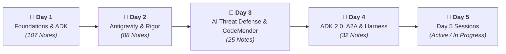

# Elevate: Comprehensive 5-Day Agent Engineering Curriculum

> **"You’ve learned how to build agents. Now let’s learn how to engineer them."**
> 
> *Building an agent is a weekend project.*
> *Building one that a team can maintain, extend, and trust in production is an engineering problem.*
> 
> **That distinction is the whole session.**

---

## 5-Day Event Structure & Daily Navigation

| Day | Status | Focus / Themes | Link |
| :---: | :---: | :--- | :---: |
| **Day 1** | **Completed** | **Foundations, Architecture & Google ADK (107 Notes)** Foundations · Grounding/RAG · OKF · Google ADK 4 Pillars · Skills · MCP · Multi-Agent Systems · ADK Eval · Cloud Deployment | [Day 1 Notes](Day_1/README.md) |
| **Day 2** | **Completed** | **Antigravity, Software Rigor, Modernization & AI Security (88 Notes)** Antigravity Harness · Skills Architecture · Context Economics · Mainframe/.NET/DB Modernization · MCP Governance · WIF/STS · Wiz AI-APP | [Day 2 Notes](Day_2/README.md) |
| **Day 3** | **Completed** | **AI Threat Defense, Secure SDLC & Autonomous Remediation (25 Notes)** Machine-Speed Defense · Autonomous Threat Actors · Shift-Left/Shift-Right Realities · Wiz AI DAST Funnel · CodeMender Engine | [Day 3 Notes](Day_3/README.md) |
| **Day 4** | **Completed** | **ADK 2.0, A2A Protocol, Runtime Architecture & Harness Engineering (32 Notes)** ADK 2.0 Graph Execution · Memory Bank · A2A Protocol · Agent Platform Runtime · 7 Evaluation Dimensions · 8 Eval Methodologies · Harness Engineering ($\text{Agent} = \text{Model} + \text{Harness}$) · MCP Toolbox for Databases · Vector DB Architecture | [Day 4 Notes](Day_4/README.md) |
| **Day 5** | **Active** | **Day 5 Sessions, Production Synthesis & Capstone** | [Day 5 Notes](Day_5/README.md) |

---

## Daily Modules & Deep-Dive Indexes

* **[Day 1 Master Index (107 Notes)](Day_1/README.md)**: Agent mental models, RAG architectures, Google ADK 4 Pillars, Skills, MCP, Multi-Agent swarms, Golden Dataset Evals, and Cloud Run / Agent Runtime deployments.
* **[Day 2 Master Index (88 Notes)](Day_2/README.md)**: Antigravity 2.0 multi-surface harness, Git worktree isolation, Context economics, Legacy enterprise modernization (.NET, Mainframe, DBs), Enterprise IAM (WIF/STS), and Wiz AI Security Graph.
* **[Day 3 Master Index (25 Notes)](Day_3/README.md)**: Unified defensive framework for agentic AI, machine-speed AppSec, state-sponsored AI actors, Shift-Left / Shift-Right closed loop, 5-phase Wiz attack surface assessment funnel, and CodeMender autonomous patching.
* **[Day 4 Master Index (32 Notes)](Day_4/README.md)**: Google ADK 2.0 graph engine, cognitive memory hierarchy, A2A open protocol, SPIFFE Dual-Gate identity, the 7 evaluation dimensions, 8 evaluation methodologies, Harness Engineering, MCP Toolbox for Databases, and Vector DB topologies.
* **[Day 5 Master Index (Active)](Day_5/README.md)**: Active session notes, architectures, code artifacts, and deep dives for Day 5.

---

## Cross-Curriculum Playbooks & Repository Navigation

* **[Repository Root Hub (`README.md`)](../README.md)**
* **[Elevate Exam Study Guide & Master Cram Sheet](../docs/STUDY_GUIDE.md)**
* **[55-Question Practice Knowledge Check](../docs/PRACTICE_EXAM_50Q.md)**
* **[Mock Assessment Review — Q12–Q30 (Grounded Answer Key)](../docs/MOCK_ASSESSMENT_Q12_Q30.md)**
* **[Master 5-Day Technical Synthesis](../docs/MASTER_SYNTHESIS.md)**
* **[Google Cloud CE & DBCE Decision Playbook](../docs/CE_PLAYBOOK.md)**
* **[CLI & Python SDK Quick-Reference Cheat Sheet](../docs/CLI_AND_SDK_CHEATSHEET.md)**
