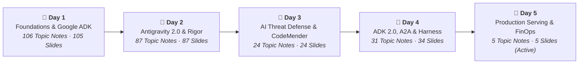

# Elevate: 5-Day Agent Engineering Curriculum & Architecture Playbook

> **"You’ve learned how to build agents. Now let’s learn how to engineer them."**
>
> *Building an agent is a weekend project.*
> *Building one that a team can maintain, extend, and trust in production is an engineering problem.*
>
> **That distinction is the whole session.**

---

## 1. Curriculum Architecture & 5-Day Progression

This repository captures the complete **5-Day Elevate Agent Engineering Curriculum** (**253 topic notes** and **255 slide deck captures** across `Notes/Day_1` through `Notes/Day_5`), paired with cross-curriculum engineering syntheses, Google Cloud Customer Engineering (CE / DBCE) decision playbooks, CLI/SDK reference cheat sheets, and deterministic verification tooling.



| Day | Status | Core Engineering Themes | Master Index |
| :---: | :---: | :--- | :---: |
| **Day 1** | Completed | **Foundations, Grounding & Google ADK**<br/>SDK vs. ADK · 180-Config Multi-Agent Empirical Study · 2-Stage Vertex AI RAG · Open Knowledge Format (OKF) · ADK 4 Pillars · Skills & MCP · Golden Dataset Eval (`adk eval`) · Agent Runtime / Cloud Run / GKE | [Day 1 Index](Notes/Day_1/README.md) |
| **Day 2** | Completed | **Antigravity 2.0, Software Rigor, Modernization & AI Security**<br/>Antigravity 2.0 Surfaces (`agy`, Hub, IDE Extensions, SDK) · 3-Level Progressive Disclosure & 5 Skill Archetypes · Context Engineering ($C = P + M$) · Spec-Driven Development (`README`/`AGENTS`/`SPEC`/`SKILL`) · Mainframe (MAT + Dual Run), .NET 8 (`CodMod`) & DB Modernization (DMS + AlloyDB) · Governed MCP (Dual-Gate IAM, CEL Deny, Model Armor) · WIF+SCIM · Wiz AI-APP | [Day 2 Index](Notes/Day_2/README.md) |
| **Day 3** | Completed | **AI Threat Defense, Secure SDLC & Autonomous Remediation**<br/>Machine-Speed AppSec ($10\times$ Recon, 85% Automated CVE PoCs) · Adversarial AI Case Studies · Shift-Left Security Co-Pilots (*"Autocomplete, Not an Audit"*) + Shift-Right Runtime Sensors (Wiz Defend, Model Armor) · 5-Phase Wiz AI DAST Funnel (99.5% Noise Reduction) · CodeMender (`cm`) Autonomous AST Patching | [Day 3 Index](Notes/Day_3/README.md) |
| **Day 4** | Completed | **ADK 2.0 Graph Engine, A2A Protocol, Runtime & Harness Engineering**<br/>ADK 2.0 `StateGraph` & 4-Tier Scoped State · 6 Lifecycle Callbacks · Vertex AI Memory Bank (`PreloadMemoryTool`) · ADK 2.0 vs. LangGraph · A2A Open Protocol (`/.well-known/agent.json`) vs. MCP · Agent Platform Runtime & SPIFFE Dual-Gate Identity ($\min(\text{User}, \text{Agent})$) · 7 Eval Dimensions & 8 Methodologies · $\text{Agent} = \text{Model} + \text{Harness}$ · MCP Toolbox for Databases · Vector DB Matrix | [Day 4 Index](Notes/Day_4/README.md) |
| **Day 5** | Active | **Enterprise Model Serving, Routing, FinOps & Production Capstone**<br/>5 Vertex AI Consumption Tiers (Provisioned Throughput at 80–85% + PayGo Spillover vs. Flex/Batch $\ge 50\%$ Discount) · 3-Stage Cascading Semantic Router ($\sim 5\text{ms}$ across Gemini Pro, Flash & Flash-Lite) · 90% Implicit & Explicit Context Caching (`CachedContent` API) | [Day 5 Index](Notes/Day_5/README.md) |

---

## 2. Cross-Curriculum Playbooks & Quick-Reference Guides (`docs/`)

| Document | Audience & Purpose | Link |
| :--- | :--- | :---: |
| **Elevate Exam Study Guide & Master Cram Sheet** | High-density exam preparation guide featuring the Master Quantitative Metrics, Thresholds, Formulas & SLAs Table, Top 25 Exam Trap Distractors vs. Ground Truth, and Day 1–5 Architecture Comparison Matrices. | [docs/STUDY_GUIDE.md](docs/STUDY_GUIDE.md) |
| **55-Question Practice Knowledge Check** | Full-length 55-question self-test practice exam across Days 1–5 with a 30-second Quick Scoring Grid and detailed answer rationales linked to source curriculum notes. | [docs/PRACTICE_EXAM_50Q.md](docs/PRACTICE_EXAM_50Q.md) |
| **Master 5-Day Technical Synthesis** | End-to-end architectural synthesis distilling all 5 days into a single cohesive engineering guide with direct links to underlying session notes. | [docs/MASTER_SYNTHESIS.md](docs/MASTER_SYNTHESIS.md) |
| **Google Cloud CE & DBCE Decision Playbook** | Field decision matrices for customer architectures: multi-agent sizing, Text-to-SQL with OKF + MCP Toolbox for Databases, Vector DB selection (Vertex AI ScaNN vs. BigQuery vs. AlloyDB/Spanner), Mainframe/.NET/Oracle modernization, WIF+SCIM vs. Cloud Identity, 4-Layer MCP security, and Vertex AI FinOps. | [docs/CE_PLAYBOOK.md](docs/CE_PLAYBOOK.md) |
| **CLI & Python SDK Cheat Sheet** | Copy-paste command and code recipes for `agents-cli`, `adk`, `gcloud iam policies`, `gcloud model-armor`, CodeMender (`cm`), `google.adk`, and `google.genai` Explicit Context Caching. | [docs/CLI_AND_SDK_CHEATSHEET.md](docs/CLI_AND_SDK_CHEATSHEET.md) |

---

## 3. Thematic Domain Directory

### Foundations, Context Engineering & Specification Rigor
- **SDK vs. ADK & When Not to Use Agents**: [First of All: SDK ≠ ADK](Notes/Day_1/sdk_vs_adk.md) · [You Don't Always Need Agents](Notes/Day_1/you_dont_always_need_agents.md) · [Agent Challenges Overview](Notes/Day_1/agent_challenges.md)
- **Empirical Multi-Agent Laws (180 Configurations)**: [More Agents ≠ Automatically Better](Notes/Day_1/more_agents_not_automatically_better.md) · [Three Governing Principles (+81% Alignment vs. Sequential Penalty)](Notes/Day_1/multi_agent_wins_and_loses.md) · [Architecture Is a Safety Feature (17.2× vs. 4.4× Error Amplification)](Notes/Day_1/architecture_is_a_safety_feature.md)
- **Context Engineering ($C = P + M$)**: [The Model Is Not the Variable You Control](Notes/Day_2/the_model_is_not_the_variable_you_control.md) · [Prompt Is Not Context Formula](Notes/Day_2/prompt_is_not_context_formula.md) · [Write, Select, Compress, Isolate](Notes/Day_2/four_principles_of_context_engineering.md) · [Context Collapse vs. Observation Flooding](Notes/Day_2/context_collapse_and_observation_flooding.md) · [Subagent Context Isolation](Notes/Day_2/subagents_context_isolation.md)
- **Specification-Driven Development (SDD)**: [Beyond "Vibe Coding"](Notes/Day_2/beyond_vibe_coding.md) · [Same Model, Same Task (`AGENTS.md`)](Notes/Day_2/same_model_same_task_agents_md.md) · [Four Files, Four Audiences](Notes/Day_2/four_files_four_audiences.md) · [Anatomy of High-Fidelity Specs](Notes/Day_2/anatomy_of_high_fidelity_specs.md)
- **Harness Engineering**: [What Is a Harness? ($\text{Agent} = \text{Model} + \text{Harness}$)](Notes/Day_4/what_is_a_harness_agent_equals_model_plus_harness.md)

### Google ADK 1.x / 2.0, Skills, MCP & A2A Interoperability
- **Google ADK 2.0 Runtime & Graph Engine**: [ADK 4 Core Pillars](Notes/Day_1/adk_core_architecture_pillars.md) · [ADK 1.x to 2.0 Graph Execution Engine (`StateGraph`)](Notes/Day_4/adk_2_paradigm_shift_graph_execution_engine.md) · [Runner, Session, 4-Tier Scoped State & Contexts](Notes/Day_4/google_adk_architecture_runner_session_state_context.md) · [6 Callbacks & Lifecycle Hooks](Notes/Day_4/adk_concepts_callbacks_lifecycle_hooks.md) · [ADK 2.0 vs. LangGraph](Notes/Day_4/adk_2_vs_langgraph_competitive_architecture_matrix.md)
- **Cognitive Memory & Vertex AI Memory Bank**: [ADK 4-Tier Memories](Notes/Day_1/adk_memories.md) · [Episodic, Semantic & Procedural Memory Hierarchy](Notes/Day_4/agent_memory_hierarchy_episodic_semantic_procedural.md) · [How Memory Bank Works](Notes/Day_4/how_memory_bank_works_step_1_initiate_session.md) · [`PreloadMemoryTool()` Code Reference](Notes/Day_4/adk_framework_code_example_preload_memory_tools.md)
- **Skills & Progressive Disclosure**: [3 Levels of Progressive Disclosure (When, How, What)](Notes/Day_2/progressive_disclosure_when_how_what.md) · [The 5 Functional Skill Archetypes](Notes/Day_2/skill_patterns_5_archetypes.md) · [Authoring Antigravity Skills](Notes/Day_2/authoring_antigravity_skills.md) · [CE Tech Skills Marketplace](Notes/Day_2/ce_tech_skills_marketplace.md)
- **Model Context Protocol (MCP) & Agent-to-Agent (A2A)**: [Solving the $N \times M$ Problem](Notes/Day_2/nxm_problem_custom_connectors.md) · [Local Function or MCP?](Notes/Day_1/local_function_or_mcp.md) · [Virtual MCP Toolsets](Notes/Day_2/toolsets_protect_the_context_window.md) · [A2A Open Protocol](Notes/Day_4/a2a_open_protocol_agent_to_agent_interoperability.md) · [`/.well-known/agent.json` Schema](Notes/Day_4/a2a_agent_card_well_known_discovery_schema.md) · [A2A vs. MCP Coexistence](Notes/Day_4/a2a_vs_mcp_coexistence_architecture.md)

### Data, Databases, RAG & Enterprise Modernization
- **Open Knowledge Format (OKF) & RAG**: [Vertex AI 2-Stage RAG Architecture](Notes/Day_1/rag_vertex_ai_architecture_example.md) · [Open Knowledge Format (OKF)](Notes/Day_1/open_knowledge_format_okf.md) · [OKF Two Halves & Attention Economics](Notes/Day_1/okf_file_structure_two_halves.md) · [OKF WAU Implementation Example](Notes/Day_1/okf_bundle_example_wau.md)
- **Databases & Vector Topologies**: [Google MCP Toolbox for Databases (`go/mcp-toolbox`)](Notes/Day_4/mcp_toolbox_for_databases_overview.md) · [Data as a Tool Design Options](Notes/Day_4/data_as_a_tool_mcp_design_options_tradeoffs.md) · [Vector DB Decision Matrix (Vertex AI ScaNN vs. BigQuery vs. AlloyDB/Spanner)](Notes/Day_4/vector_database_design_options_tradeoffs.md) · [Example: MCP for BigQuery](Notes/Day_2/example_mcp_for_bigquery.md)
- **Legacy Enterprise Modernization**: [Google Cloud Modernize Hub](Notes/Day_2/google_cloud_modernize_hub_preview.md) · [End-to-End AI Mainframe Modernization (MAT + Dual Run)](Notes/Day_2/end_to_end_ai_powered_mainframe_modernization.md) · [Windows / .NET 8 Modernization with `CodMod`](Notes/Day_2/windows_modernization_codmod_advisor.md) · [Database Modernization (DMS + AlloyDB + Cloud SQL)](Notes/Day_2/database_modernization_dms_alloydb_cloudsql.md)

### Security, Identity, Evaluation & Production FinOps
- **AI Threat Defense, Wiz & CodeMender**: [4-Stage Google & Wiz Readiness Lifecycle](Notes/Day_3/ai_threat_defense_google_and_wiz_lifecycle.md) · [How AI Scales Attacks (10× Recon, 85% CVE PoCs)](Notes/Day_3/how_ai_scales_attacks_by_the_numbers.md) · [Shift-Left vs. Shift-Right Unified Loop](Notes/Day_3/shift_left_vs_shift_right_not_a_binary_choice.md) · [Wiz 5-Phase AI DAST Funnel](Notes/Day_3/wiz_attack_surface_assessment_stages_console.md) · [CodeMender + Wiz Autonomous Remediation](Notes/Day_3/codemender_wiz_integration_architecture.md)
- **Enterprise Identity & Runtime Governance**: [Agent Platform Runtime & SPIFFE Dual-Gate Identity](Notes/Day_4/agent_platform_runtime_master_architecture.md) · [Dual-Layer MCP IAM](Notes/Day_2/mcp_authorization_controls_iam.md) · [IAM Deny + CEL Read-Only Guardrails](Notes/Day_2/mcp_iam_deny_fine_grained_controls.md) · [Model Armor Integration](Notes/Day_2/google_mcp_server_model_armor.md) · [WIF + SCIM vs. Cloud Identity SSO](Notes/Day_2/wif_for_gemini_enterprise.md)
- **Scientific Agent Evaluation**: [Trajectory vs. Response Evaluation](Notes/Day_1/trajectory_vs_response.md) · [The Golden Dataset](Notes/Day_1/the_golden_dataset.md) · [The 7 Dimensions of Agent Evaluation](Notes/Day_4/agent_eval_seven_dimensions_framework.md) · [Dimension 7: Self-Repair & Test Immutability](Notes/Day_4/eval_dimension_7_self_repair_behaviour.md) · [The 8 Evaluation Methodologies Playbook](Notes/Day_4/eval_methods_deep_dive_tooling_playbook.md)
- **Deployment, Model Serving & FinOps**: [Agent Runtime vs. Cloud Run vs. GKE](Notes/Day_1/three_targets_one_decision.md) · [Google Agents CLI 7 Core Commands](Notes/Day_4/agents_cli_core_commands_reference.md) · [5 Vertex AI Consumption Options](Notes/Day_5/foundation_model_consumption_options.md) · [Hybrid PT + PayGo Spillover](Notes/Day_5/choosing_the_right_consumption_option.md) · [3-Stage Cascading Semantic Router](Notes/Day_5/routing_patterns_rule_llm_semantic.md) · [Implicit vs. Explicit Context Caching (90% Savings)](Notes/Day_5/gemini_context_caching_implicit_vs_explicit.md)

---

## 4. Repository Structure

This repository implements the [Four Files, Four Audiences](Notes/Day_2/four_files_four_audiences.md) architecture taught in Day 2:

```text
elevate/
├── README.md                                      # Human-centric project & curriculum overview
├── AGENTS.md                                      # Machine-centric repository invariants & verification rules
├── .gemini/
│   └── skills/
│       └── elevate-curriculum/
│           └── SKILL.md                           # Workspace-scoped progressive disclosure skill
├── docs/
│   ├── STUDY_GUIDE.md                             # Exam study guide, metrics/formulas table & cram matrices
│   ├── PRACTICE_EXAM_50Q.md                       # 55-question self-test knowledge check & answer key
│   ├── MASTER_SYNTHESIS.md                        # Comprehensive 5-day technical synthesis
│   ├── CE_PLAYBOOK.md                             # Google Cloud CE & DBCE architecture decision matrices
│   └── CLI_AND_SDK_CHEATSHEET.md                  # Consolidated CLI & Python SDK reference recipes
├── Notes/
│   ├── README.md                                  # Curriculum master index
│   ├── Day_1/                                     # 106 topic notes + 105 slide PNGs in assets/
│   ├── Day_2/                                     # 87 topic notes + 87 slide PNGs in assets/
│   ├── Day_3/                                     # 24 topic notes + 24 slide PNGs in assets/
│   ├── Day_4/                                     # 31 topic notes + 34 slide PNGs in assets/
│   └── Day_5/                                     # 5 topic notes + 5 slide PNGs in assets/ (Active)
└── scripts/
    └── verify_repo.py                             # Deterministic link, index, fence & PNG verifier
```

---

## 5. Verification

Run the deterministic verification gate to validate all relative Markdown links, daily index coverage, code fences, and PNG slide assets across the repository:

```bash
python3 scripts/verify_repo.py
```
