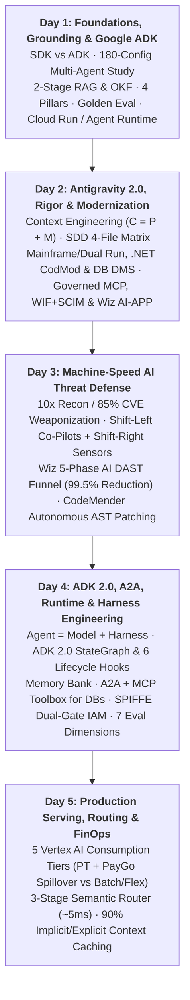

# Elevate: 5-Day Agent Engineering Master Technical Synthesis

> **"You’ve learned how to build agents. Now let’s learn how to engineer them."**
>
> *Building an agent is a weekend project. Building one that a team can maintain, extend, and trust in production is an engineering problem.*
> — [Master Curriculum Index](../Notes/README.md)

---

## 1. End-to-End 5-Day Engineering Stack

---

## 2. Day 1 — Foundations, Architecture & Google ADK

Full Index: [Notes/Day_1/README.md](../Notes/Day_1/README.md) (`106` Topic Notes · `105` Slide Assets)

### A. Core Mental Models & Empirical Multi-Agent Laws
- **SDK vs. ADK** ([sdk_vs_adk.md](../Notes/Day_1/sdk_vs_adk.md), [why_do_we_need_adk.md](../Notes/Day_1/why_do_we_need_adk.md)):
    - **Model SDK (`google-genai`)**: Low-level API wrapper for single model calls; requires bespoke `while` loops, manual JSON parsing, and brittle prompt surgery.
    - **Agent Development Kit (`google.adk`)**: High-level agent runtime providing first-class `Tool`, `State`, `Workflow`, and `Skills` primitives, OpenTelemetry trajectory tracing, and `adk eval` regression gates. *"ADK does not make agents possible—it makes them maintainable."*
- **When NOT to Use Agents** ([you_dont_always_need_agents.md](../Notes/Day_1/you_dont_always_need_agents.md), [when_are_agents_a_good_fit.md](../Notes/Day_1/when_are_agents_a_good_fit.md)):
    - **Traditional ML / Rules**: Sub-10ms latency SLAs, deterministic financial/regulatory compliance, fraud/credit scoring.
    - **Plain LLM Calls**: Single-turn classification, translation, summarization, or structured extraction.
    - **Standard RAG**: Read-only enterprise Q&A where no dynamic multi-step tool orchestration is required.
    - **Autonomous Agents**: Justified **only** when goals require multi-step reasoning, runtime adaptation, and dynamic tool orchestration where the execution path cannot be hardcoded in advance.
- **Empirical Multi-Agent Laws (Google Research 180-Configuration Study)** ([more_agents_not_automatically_better.md](../Notes/Day_1/more_agents_not_automatically_better.md), [multi_agent_wins_and_loses.md](../Notes/Day_1/multi_agent_wins_and_loses.md), [architecture_is_a_safety_feature.md](../Notes/Day_1/architecture_is_a_safety_feature.md)):
    1. **Serial Reliability Decay**: $\text{Accuracy}_{\text{total}} = \prod_{i=1}^N \text{Accuracy}_i$ (four 90%-accurate agents in series yield $0.9^4 = 65.6\%$ end-to-end reliability).
    2. **Alignment Principle (`+81%` gain)**: Decomposable, parallelizable subtasks under centralized coordination outperform a single model by **+81%**.
    3. **Sequential Penalty (`39%–70%` degradation)**: Tasks requiring strict step-by-step sequential reasoning **degrade by 39%–70%** when split across multiple agents because lossy text handoffs fragment latent Chain-of-Thought. Keep sequential reasoning inside a single frontier model.
    4. **Tool-Use Bottleneck (`16+` tools)**: When a system requires **16+ tools**, multi-agent routing tax explodes; **1–2 agents with progressive-disclosure Skills/MCP** win.
    5. **Error Amplification (`17.2×` vs. `4.4×`)**: Independent unchecked meshes amplify hallucinations by **17.2×**. A centralized orchestrator enforcing **Pydantic Schema (`output_schema`)**, **Grounding Citation**, and **Policy (`after_subagent_callback`)** gates reduces amplification to **4.4× (~75% reduction)**.

### B. The 3 Challenge Pillars, 2-Stage RAG & Open Knowledge Format (OKF)
- **3 Challenge Pillars** ([agent_challenges.md](../Notes/Day_1/agent_challenges.md), [mitigating_predictability.md](../Notes/Day_1/mitigating_predictability.md), [mitigating_stability.md](../Notes/Day_1/mitigating_stability.md), [mitigating_operations.md](../Notes/Day_1/mitigating_operations.md)):
    - **Predictability**: Mitigate via reasoning models, RAG grounding, CoT/few-shot prompts, `session.state`, and deterministic workflow guardrails.
    - **Stability**: Mitigate via standardized MCP interfaces, rich typed docstrings, exponential backoff, `max_iterations` circuit breakers, and HITL gates.
    - **Operations**: Mitigate via verbose dev trajectory logs, CI/CD `adk eval`, token/latency SLOs, and OpenTelemetry spans.
- **2-Stage Vertex AI RAG** ([rag_vertex_ai_architecture_example.md](../Notes/Day_1/rag_vertex_ai_architecture_example.md), [classic_information_retrieval.md](../Notes/Day_1/classic_information_retrieval.md)):
    - **Stage 1 (Recall)**: Hybrid BM25 + `text-embedding-004` ANN lookup on **Vertex AI Vector Search (ScaNN)** retrieves top $k=100\text{–}1000$ in $<10\text{ms}$.
    - **Stage 2 (Precision Re-Ranking)**: Cross-encoder narrows to top $k=3\text{–}7$ chunks (200–500 tokens, 10–20% overlap), hydrated via **Vertex AI Feature Store / Bigtable** into a strict closed-book prompt template ([rag_modified_prompt_template.md](../Notes/Day_1/rag_modified_prompt_template.md)).
- **Open Knowledge Format (OKF)** ([open_knowledge_format_okf.md](../Notes/Day_1/open_knowledge_format_okf.md), [okf_file_structure_two_halves.md](../Notes/Day_1/okf_file_structure_two_halves.md), [agent_concept_accountability.md](../Notes/Day_1/agent_concept_accountability.md), [okf_bundle_example_wau.md](../Notes/Day_1/okf_bundle_example_wau.md)):
    - Prevents plausible business falsehoods (e.g., calculating WAU without excluding internal accounts or bot traffic) by storing institutional definitions as git-native Markdown bundles (`tables/`, `metrics/`, `policies/`, `runbooks/`).
    - **Two Halves**: **YAML Frontmatter (~20–60 tokens)** (`type`, `title`, `tags`, `verified`, `stale_after`, `status`, `author`, `verifier`) + **Markdown Body (300–3,000+ tokens)** lazy-loaded only when relevant.
    - **Runtime Provenance Filter**: `WHERE verified == true AND status == 'stable' AND current_date < stale_after`.

### C. Google ADK 4 Pillars, Evaluation & Cloud Deployment
- **4 Core Pillars** ([adk_core_architecture_pillars.md](../Notes/Day_1/adk_core_architecture_pillars.md)): **Tools** (Actions), **State** (`session.state` shared blackboard), **Workflows** (`SequentialAgent`, `ParallelAgent`, `LoopAgent`, `StateGraph`, `LlmAgent` Coordinator/Hierarchy/Swarm), and **Skills** (Progressive disclosure).
- **4-Tier ADK Memory** ([adk_memories.md](../Notes/Day_1/adk_memories.md)): (1) **Events** (`session.events` immutable log), (2) **State** (`session.state` mutable key-value scratchpad), (3) **Artifacts** (`artifact://` binary URI offloading), (4) **Long-Term Memory** (`VertexAiMemoryService`).
- **ADK Eval & Golden Datasets** ([trajectory_vs_response.md](../Notes/Day_1/trajectory_vs_response.md), [the_golden_dataset.md](../Notes/Day_1/the_golden_dataset.md), [setting_the_bar.md](../Notes/Day_1/setting_the_bar.md)):
    - Evaluates the 3-tuple **`Query -> Trajectory (Tool Calls + Args) -> Final Response`** to catch **Lucky Hallucinations**.
    - Baseline gates in `test_config.json`: `"tool_trajectory_avg_score": 0.8` and `"response_match_score": 0.5`.
- **Cloud Deployment Targets** ([three_targets_one_decision.md](../Notes/Day_1/three_targets_one_decision.md), [a_restart_must_not_erase_memory.md](../Notes/Day_1/a_restart_must_not_erase_memory.md), [the_other_two_axes_cold_start_and_billing.md](../Notes/Day_1/the_other_two_axes_cold_start_and_billing.md)):
    - **Agent Runtime (Vertex AI Agent Engine)**: Built-in `VertexAiSessionService`, $<800\text{ms}$ cold start.
    - **Cloud Run**: Scales to $\$0.00$ idle, $1.5\text{–}4.0\text{s}$ cold start; **must externalize state** (`--agent_engine_id` or Firestore/Cloud SQL/AlloyDB) because default `InMemorySessionService` wipes memory on scale-to-zero.
    - **GKE**: $0\text{ms}$ pre-warmed pods, custom GPUs/TPUs, strict VPC-SC.

---

## 3. Day 2 — Antigravity 2.0, Software Rigor, Modernization & AI Security

Full Index: [Notes/Day_2/README.md](../Notes/Day_2/README.md) (`87` Topic Notes · `87` Slide Assets)

### A. Antigravity 2.0 Multi-Surface Harness & Skills Architecture
- **One Harness, Four Surfaces** ([antigravity_one_harness_many_surfaces.md](../Notes/Day_2/antigravity_one_harness_many_surfaces.md), [antigravity_surfaces_deepdive_2_0_ide_cli.md](../Notes/Day_2/antigravity_surfaces_deepdive_2_0_ide_cli.md)):
    1. **Antigravity 2.0 Hub**: Visual multi-agent desktop/web GUI with split-pane Artifacts Viewer (`task.md`, `implementation_plan.md`, `walkthrough.md`), interactive `Proceed` gates, and subagent trees.
    2. **Antigravity CLI (`agy`)**: Terminal-native runner with full `GEMINI.md`/`AGENTS.md` parity, UNIX pipe integration, and live session handoff to Antigravity 2.0.
    3. **Antigravity IDE Extensions**: VS Code, JetBrains IntelliJ, Visual Studio, and Xcode extensions.
    4. **Antigravity SDK**: Python/TypeScript library for embedding the harness into custom apps and portals.
- **Compliance Block on Standalone Consumer Antigravity IDE** ([dont_use_antigravity_ide.md](../Notes/Day_2/dont_use_antigravity_ide.md)): The standalone consumer `Antigravity IDE` app lacks Google Cloud ToS, HIPAA/SOC2, IP indemnification, and Workspace/`@google.com` identity support—always use IDE Extensions, `agy` CLI, or Antigravity 2.0 Hub.
- **3-Level Progressive Disclosure & 5 Skill Archetypes** ([progressive_disclosure_when_how_what.md](../Notes/Day_2/progressive_disclosure_when_how_what.md), [skill_patterns_5_archetypes.md](../Notes/Day_2/skill_patterns_5_archetypes.md)):
    - **Level 1 — WHEN** (YAML frontmatter `name` + `description`, ~20–50 tokens at startup) $\rightarrow$ **Level 2 — HOW** (`SKILL.md` body, ~500–2,000 tokens hydrated JIT) $\rightarrow$ **Level 3 — WHAT** (`scripts/`, `references/`, `assets/`, 0 baseline tokens).
    - **5 Archetypes**: *Informational*, *Tool Wrapper*, *Generator* (*"Experience Before Theory"*), *Reviewer*, and *Workflow*.

### B. Context Engineering & Specification-Driven Development (SDD)
- **The Context Equation** ([prompt_is_not_context_formula.md](../Notes/Day_2/prompt_is_not_context_formula.md), [the_model_is_not_the_variable_you_control.md](../Notes/Day_2/the_model_is_not_the_variable_you_control.md), [what_is_context_engineering.md](../Notes/Day_2/what_is_context_engineering.md)):
  $$\mathbf{C = P + M}$$
  where $P$ is the **Prompt-Visible Working Set** (System Prompt 5–10%, Tools/Context 20–30%, History 20–40%, **Free Headroom 30–50%**) and $M$ is the **External Context Universe** (`PLAN.md`, Memory Bank, OKF, BigQuery).
- **4 Core Principles** ([four_principles_of_context_engineering.md](../Notes/Day_2/four_principles_of_context_engineering.md)): **WRITE** (externalize state to disk), **SELECT** (pull JIT via Skills/OKF/MCP), **COMPRESS** (intentional checkpoints & driver-level pagination `-max_results=50`), **ISOLATE** (subagent shock absorbers & git worktrees).
- **Virtual MCP Toolsets & Subagent Shock Absorbers** ([toolsets_protect_the_context_window.md](../Notes/Day_2/toolsets_protect_the_context_window.md), [subagents_context_isolation.md](../Notes/Day_2/subagents_context_isolation.md)):
    - Partition monolithic 100-tool MCP servers ($30\text{k–}80\text{k}$ tokens/turn) into domain-scoped **Virtual MCP Toolsets** (`.../toolsets/bigquery_sql_readonly`, $1\text{k–}4\text{k}$ tokens/turn).
    - Delegate noisy exploration to isolated **Subagents** that return a 3-part contract: *(1) What Was Found, (2) What Failed, (3) What Matters*.
- **Four Files, Four Audiences** ([four_files_four_audiences.md](../Notes/Day_2/four_files_four_audiences.md), [anatomy_of_high_fidelity_specs.md](../Notes/Day_2/anatomy_of_high_fidelity_specs.md)):
    - `README.md` (Humans · Project · Permanent)
    - `AGENTS.md` (Agents · Repo · Persistent across tasks)
    - `SPEC.md` (Human & Agent · One Change · Feature-scoped)
    - `SKILL.md` (Agents · One Capability · Reusable across repos)

### C. Enterprise Application & Database Modernization
- **4-Stage AI Mainframe Modernization** ([end_to_end_ai_powered_mainframe_modernization.md](../Notes/Day_2/end_to_end_ai_powered_mainframe_modernization.md), [mainframe_agentic_rewrite_loop.md](../Notes/Day_2/mainframe_agentic_rewrite_loop.md), [de_risk_with_dual_run.md](../Notes/Day_2/de_risk_with_dual_run.md)):
    1. **Mainframe Assessment Tool (MAT)**: Extracts call graphs and natural-language business rules from COBOL/PL/I/JCL/CICS.
    2. **Mainframe Agents + Gemini 3.1**: Compiles business rules into `SPEC.md` and idiomatic Java 21 / Go microservices (avoiding unmaintainable "JOBOL" transpilation).
    3. **Google Dual Run**: Shadows live mainframe traffic (`Dualize -> Execute -> Compare -> Certify`) for byte-for-byte parity certification before cutover.
    4. **Mainframe Connector & DMS**: Transcodes EBCDIC/VSAM/DB2 datasets into BigQuery, Spanner, and AlloyDB.
- **Windows / .NET 8 & Database Modernization** ([windows_modernization_codmod_advisor.md](../Notes/Day_2/windows_modernization_codmod_advisor.md), [windows_modernization_how_it_works.md](../Notes/Day_2/windows_modernization_how_it_works.md), [database_modernization_dms_alloydb_cloudsql.md](../Notes/Day_2/database_modernization_dms_alloydb_cloudsql.md)):
    - **CodMod Advisor** in **Modernize Hub**: Generates a 7-tab assessment and refactors SOAP/WCF $\rightarrow$ gRPC/Minimal APIs, WebForms $\rightarrow$ .NET 8 APIs + SPA/Blazor, and EF6 $\rightarrow$ EF Core 8 on Linux containers via the **$<2\text{ Month}$ .NET Acceleration** or **3–7 Week Accelerator** (funded via RaMP/PSF).
    - **Database Migration Service (DMS) + Gemini**: Continuous CDC replication + AI PL/SQL and T-SQL conversion into `PL/pgSQL` on **AlloyDB** (4× OLTP, 100× analytical Columnar Engine, 99.99% SLA) or **Cloud SQL** (99.95% SLA).

### D. Governed MCP, Identity (WIF vs. Cloud Identity) & Wiz AI-APP
- **4-Layer MCP Security** ([mcp_authorization_controls_iam.md](../Notes/Day_2/mcp_authorization_controls_iam.md), [mcp_iam_deny_fine_grained_controls.md](../Notes/Day_2/mcp_iam_deny_fine_grained_controls.md), [google_mcp_server_model_armor.md](../Notes/Day_2/google_mcp_server_model_armor.md), [wiz_red_agent_ai_pentesting_exploit_chain.md](../Notes/Day_2/wiz_red_agent_ai_pentesting_exploit_chain.md)):
    1. **Dual-Gate Cloud IAM**: Gate 1 checks `roles/mcp.toolUser` at the MCP Gateway; Gate 2 checks downstream service IAM (`roles/bigquery.dataViewer`) using delegated caller identity.
    2. **IAM Deny + CEL**: Enforce read-only guardrails via `api.getAttribute('mcp.googleapis.com/tool.isReadOnly', false) == false`.
    3. **Google Model Armor Floor Settings**: Inline prompt-injection, jailbreak, and SSRF URI sanitization (`--mcp-sanitization=ENABLED`).
    4. **Wiz AI-APP & Red Agent**: Multi-cloud AI-BOM discovery, toxic combination graph pruning, and continuous DAST exploit-chain testing.
- **Enterprise Identity** ([third_party_idp_sso_with_cloud_identity.md](../Notes/Day_2/third_party_idp_sso_with_cloud_identity.md), [wif_for_gemini_enterprise.md](../Notes/Day_2/wif_for_gemini_enterprise.md)): Default to **Google Cloud Identity + 3rd-Party SAML/OIDC SSO** (Okta/Entra/Ping) for 100% feature parity. Only use **Workforce Identity Federation (WIF)** when directory sync is prohibited—and always deploy **WIF + SCIM** (never pure WIF).

---

## 4. Day 3 — AI Threat Defense, Secure SDLC & Autonomous Remediation

Full Index: [Notes/Day_3/README.md](../Notes/Day_3/README.md) (`24` Topic Notes · `24` Slide Assets)

### A. Machine-Speed Threat Landscape & Adversarial Case Studies
- **Offensive Multipliers** ([how_ai_scales_attacks_by_the_numbers.md](../Notes/Day_3/how_ai_scales_attacks_by_the_numbers.md), [autonomous_threat_actors_machine_scale.md](../Notes/Day_3/autonomous_threat_actors_machine_scale.md)):
    - **10× faster reconnaissance** (weeks $\rightarrow$ hours), **85% CVE exploit PoC synthesis** directly from advisory text/patch diffs, and **~0 human oversight** post-launch.
- **Documented Threat Intelligence** ([case_studies_ai_in_adversarial_use.md](../Notes/Day_3/case_studies_ai_in_adversarial_use.md)):
    - **Chinese State Actors (Claude Code)**: Multi-file binary/source taint analysis across massive context windows to synthesize zero-day exploits in minutes.
    - **Russian Threat Groups (Gemini CLI)**: Automated network/API recon, tailored spear-phishing, and in-flight shellcode re-encoding against endpoint blocks.

### B. Shift-Left + Shift-Right Closed Loop
- **4 Continuous SDLC Security Signals** ([machinespeed_defense_in_practice.md](../Notes/Day_3/machinespeed_defense_in_practice.md), [shift_left_developer_experience_autocomplete_not_audit.md](../Notes/Day_3/shift_left_developer_experience_autocomplete_not_audit.md), [shift_right_realities_runtime_defense.md](../Notes/Day_3/shift_right_realities_runtime_defense.md)):
    1. **IDE Feedback (`< 1 sec`)**: Security Co-Pilots delivering 1-click AST fixes (*"autocomplete, not an audit"*).
    2. **CI/CD Policy Gating (`< 2 min`)**: Cloud Build, Critique AI, Binary Authorization.
    3. **Runtime Behavioral Analysis (`< 5 sec`)**: Wiz Defend eBPF sensors (catching container `/bin/sh` spawns & C2 egress) + Model Armor.
    4. **Autonomous Remediation (`< 5 min`)**: Eventarc routes runtime exploit telemetry into **CodeMender** to generate verified source patches.
- **Human-in-the-Loop Autonomy Tiers** ([shift_right_realities_runtime_defense.md](../Notes/Day_3/shift_right_realities_runtime_defense.md)):
    - **Tier 1 ($\ge 95\%$ confidence)**: Immediate autonomous containment (process kill, token revocation, IP block).
    - **Tier 2 ($80\%\text{–}94\%$ confidence)**: Autonomous CodeMender PR + test execution gated on **1-click human approval**.
    - **Tier 3 ($< 80\%$ confidence)**: Automated context enrichment + human analyst triage.

### C. 5-Phase Wiz AI DAST Funnel & CodeMender Engine
- **Wiz Attack Surface Funnel (`99.5%` Noise Reduction)** ([wiz_attack_surface_assessment_stages_console.md](../Notes/Day_3/wiz_attack_surface_assessment_stages_console.md)):
  $$\mathbf{24,402}\text{ Candidates} \xrightarrow{-95.3\%} \mathbf{1,147}\text{ Internet-Facing} \xrightarrow{-60.6\%} \mathbf{452}\text{ Fingerprinted} \xrightarrow{-48.5\%} \mathbf{233}\text{ Validated Findings} \rightarrow \mathbf{123}\text{ Attack Paths (87 Critical)}$$
- **CodeMender (`cm` CLI)** ([codemender_wiz_integration_architecture.md](../Notes/Day_3/codemender_wiz_integration_architecture.md), [codemender_ingest_from_third_party_scanners.md](../Notes/Day_3/codemender_ingest_from_third_party_scanners.md)):
    - Ingests Wiz Code, Snyk, Veracode, Checkmarx, and SonarQube SARIF/JSON (`cm import --file findings_wiz.json`).
    - Executes a tailored PoC exploit inside an isolated sandbox container to verify reachability—**eliminating 100% of false positives** before opening a unit-test-verified PR (`cm fix --id CVE-2026-4011 --create-pr`).

---

## 5. Day 4 — ADK 2.0, A2A Protocol, Runtime & Harness Engineering

Full Index: [Notes/Day_4/README.md](../Notes/Day_4/README.md) (`31` Topic Notes · `34` Slide Assets)

### A. ADK 2.0 Graph Engine, 6 Lifecycle Callbacks & Memory Bank
- **ADK 2.0 `StateGraph` & 4-Tier Scoped State** ([adk_2_paradigm_shift_graph_execution_engine.md](../Notes/Day_4/adk_2_paradigm_shift_graph_execution_engine.md), [google_adk_architecture_runner_session_state_context.md](../Notes/Day_4/google_adk_architecture_runner_session_state_context.md), [scenario_2_data_flow_scoped_variables_multiagent_pipelines.md](../Notes/Day_4/scenario_2_data_flow_scoped_variables_multiagent_pipelines.md)):
    - Combines LLM reasoning inside nodes with deterministic Python/Go graph edges (`StateGraph`, `add_node`, `add_edge`, `add_conditional_edges`), parallel scatter/gather reducers, and `interrupt()` / `resume()` HITL checkpoints (`CloudFirestoreCheckpointer`).
    - **4-Tier Scoped State**: `session` (default), `user:` (persistent per user across sessions), `app:` (global cluster), and `temp:` (single-turn scratchpad).
- **6 Lifecycle Callbacks** ([adk_concepts_callbacks_lifecycle_hooks.md](../Notes/Day_4/adk_concepts_callbacks_lifecycle_hooks.md), [scenario_3_enterprise_guardrails_pii_redaction_auditing.md](../Notes/Day_4/scenario_3_enterprise_guardrails_pii_redaction_auditing.md)):
    1. **Agent Boundary**: `before_agent_callback` (JWT auth, entitlement check, cache hit) & `after_agent_callback` (Cloud Audit Logs, OTEL spans).
    2. **Model Boundary**: `before_model_callback` (Cloud DLP SSN/CC redaction & Model Armor *before* Gemini API call) & `after_model_callback` (token metering, schema validation).
    3. **Tool Boundary**: `before_tool_callback` (Dual-Gate RBAC blocking destructive SQL deletes) & `after_tool_callback` (payload truncation).
- **Cognitive Memory Hierarchy & Vertex AI Memory Bank** ([agent_memory_hierarchy_episodic_semantic_procedural.md](../Notes/Day_4/agent_memory_hierarchy_episodic_semantic_procedural.md), [how_memory_bank_works_step_1_initiate_session.md](../Notes/Day_4/how_memory_bank_works_step_1_initiate_session.md), [adk_framework_code_example_preload_memory_tools.md](../Notes/Day_4/adk_framework_code_example_preload_memory_tools.md)):
    - Separates Short-Term working memory from Long-Term **Episodic** (MemoryBank/Firestore), **Semantic** (Vector Search/AlloyDB/OKF), and **Procedural** (`SKILL.md`/`StateGraph`) memory.
    - `PreloadMemoryTool()` hydrates user preferences in $15\text{–}30\text{ms}$ at turn start; background Gemini LROs asynchronously extract and merge long-term facts with GDPR UUID deletion support.

### B. A2A vs. MCP Coexistence & SPIFFE Dual-Gate Runtime
- **Horizontal A2A + Vertical MCP** ([a2a_vs_mcp_coexistence_architecture.md](../Notes/Day_4/a2a_vs_mcp_coexistence_architecture.md), [a2a_open_protocol_agent_to_agent_interoperability.md](../Notes/Day_4/a2a_open_protocol_agent_to_agent_interoperability.md), [a2a_agent_card_well_known_discovery_schema.md](../Notes/Day_4/a2a_agent_card_well_known_discovery_schema.md)):
    - **MCP (Vertical Downward Bus)**: Connects an agent downward to deterministic `/tools` and `/resources`.
    - **A2A (Horizontal Lateral Bus)**: Connects internal ADK agents outward to opaque external black-box agents (SAP, Salesforce Agentforce) via RFC 5785 `/.well-known/agent.json` Agent Cards, stateful `/v1/a2a/tasks`, SSE streams, and `A2A_INTERRUPT_REQUIRED`.
- **Agent Platform Runtime & SPIFFE Dual-Gate Identity** ([agent_platform_runtime_master_architecture.md](../Notes/Day_4/agent_platform_runtime_master_architecture.md), [agent_platform_runtime_end_to_end_architecture.md](../Notes/Day_4/agent_platform_runtime_end_to_end_architecture.md)):
    - Unites **Agent Registry** (Control Plane), **SPIFFE X.509 SVID Agent Identity + Dual-Gate Auth Manager** (Execution Plane), and **OTEL-Native Observability** (Telemetry Plane).
    - **Dual-Gate Formula**:
      $$\text{Effective Permission} = \min(\text{User Permissions}, \text{Agent Permissions})$$

### C. 7 Evaluation Dimensions, 8 Methodologies, Harness Engineering & DB Tooling
- **7 Evaluation Dimensions** ([agent_eval_seven_dimensions_framework.md](../Notes/Day_4/agent_eval_seven_dimensions_framework.md), [eval_dimension_1_intent_satisfaction.md](../Notes/Day_4/eval_dimension_1_intent_satisfaction.md), [eval_dimensions_2_to_4_correctness_visual_efficiency.md](../Notes/Day_4/eval_dimensions_2_to_4_correctness_visual_efficiency.md), [eval_dimensions_5_and_6_internal_quality_trajectory.md](../Notes/Day_4/eval_dimensions_5_and_6_internal_quality_trajectory.md), [eval_dimension_7_self_repair_behaviour.md](../Notes/Day_4/eval_dimension_7_self_repair_behaviour.md)):
    - *Outside-In (1–4)*: (1) **Intent Satisfaction** (35% Explicit Ask, 30% Latent Spec, 20% Dynamic Pivots, 15% Convergence), (2) **Functional Correctness**, (3) **Visual & Behavioural Fidelity** (Playwright + Gemini 2.5 Pro Vision), (4) **Cost & Efficiency**.
    - *Inside-Out (5–7)*: (5) **Code Quality & Conventions**, (6) **Trajectory Quality** (OTEL trace replay eliminating "Fragile Success"), (7) **Self-Repair Behaviour** (enforces a **Test-File Immutability Gate** where any test file diff scores `0.0`), plus transversal **Safety & RAI**.
- **8 Evaluation Methodologies** ([how_to_evaluate_eight_methods.md](../Notes/Day_4/how_to_evaluate_eight_methods.md), [eval_methods_deep_dive_tooling_playbook.md](../Notes/Day_4/eval_methods_deep_dive_tooling_playbook.md)): Standardised Benchmarks, Automated Functional Testing, Security/SAST, LLM/Agent-as-a-Judge, Browser Testing, Trajectory Inspection, Human Review ($5\text{–}10\%$), and **Biased Online Production Sampling** (over-indexing on high-cost, $\ge 4$ user corrections, and abandoned sessions).
- **Harness Engineering & MCP Toolbox for Databases** ([what_is_a_harness_agent_equals_model_plus_harness.md](../Notes/Day_4/what_is_a_harness_agent_equals_model_plus_harness.md), [mcp_toolbox_for_databases_overview.md](../Notes/Day_4/mcp_toolbox_for_databases_overview.md), [vector_database_design_options_tradeoffs.md](../Notes/Day_4/vector_database_design_options_tradeoffs.md)):
    - Formalizes $\mathbf{Agent = Model + Harness}$ (Sandboxes + MCP/A2A + 6 Lifecycle Hooks + Self-Repair Loops).
    - **Google MCP Toolbox for Databases (`go/mcp-toolbox`)**: Open-source gateway providing $<10$-line ADK Python integration (`McpToolboxClient`), connection pooling, SPIFFE/IAM auth, and OTEL tracing across AlloyDB, Spanner, Cloud SQL, BigQuery, Looker, Bigtable, Firestore, Memorystore, and Neo4j.

---

## 6. Day 5 — Enterprise Model Serving, Routing & Cost Economics

Full Index: [Notes/Day_5/README.md](../Notes/Day_5/README.md) (`5` Topic Notes · `5` Slide Assets · Capstone Active)

### A. 5 Vertex AI Consumption Options & Hybrid Spillover
- **5 Consumption Tiers** ([foundation_model_consumption_options.md](../Notes/Day_5/foundation_model_consumption_options.md), [choosing_the_right_consumption_option.md](../Notes/Day_5/choosing_the_right_consumption_option.md)):
    1. **Provisioned Throughput (PT)**: Reserved PTUs with deterministic sub-second SLA; right-size to **$80\text{–}85\%$ baseline utilization** via minute-level telemetry.
    2. **Standard PayGo**: Serverless per-token default for variable traffic and PT burst spillover.
    3. **Priority PayGo**: Preferential cluster queue and elevated burst RPM/TPM for VIP/flash workloads without fixed PT commitments.
    4. **Flex PayGo (`~50%` discount)**: Opportunistic spare-capacity execution for latency-tolerant internal agents (PR reviewers, lint bots, overnight refactors).
    5. **Batch Inference ($\ge 50\%$ discount)**: Async GCS/BigQuery JSONL pipelines with no HTTP timeouts for massive backlogs and offline eval flywheels.

### B. Gemini Context Caching: Implicit vs. Explicit
- **90% Token Savings** ([gemini_context_caching_implicit_vs_explicit.md](../Notes/Day_5/gemini_context_caching_implicit_vs_explicit.md)):
    - **Implicit Caching**: Zero setup (enabled by default), **90% discount** on matching prefixes above a model-specific minimum (`2,048` Gemini 2.5 / `4,096` Gemini 3.x on the Gemini API). Requires **Static-First Prompt Ordering**: `[System Instructions + Tool Schemas + Reference Docs]` $\rightarrow$ `[Dynamic User Query / Latest Tool Output]`.
    - **Explicit Caching (`CachedContent` API)**: Declarative handle (`cached_content=cache.name`) with guaranteed persistence SLA (**60-minute default TTL**, **90% discount on Gemini 2.5+**) for multi-user portals querying shared corpora.

### C. 3-Stage Cascading Hybrid Model Router
- **Smallest-Model-First Principle** ([model_routing_semantic_router_tiers.md](../Notes/Day_5/model_routing_semantic_router_tiers.md), [routing_patterns_rule_llm_semantic.md](../Notes/Day_5/routing_patterns_rule_llm_semantic.md)):
    1. **Stage 1 — Rule Filter (`< 1ms`, $\$0$)**: Slash commands (`/plan`, `/eval`) & explicit API flags.
    2. **Stage 2 — Semantic Vector Match (`~5ms`, $\sim\$0$)**: Matches query embedding against intent centroids; if **cosine similarity $\ge 0.82$**, dispatches to **Gemini Flash-Lite** (`~100–200ms`, `$`), **Gemini Flash** (`~200–400ms`, `$$`), or **Gemini Pro** (`~800ms–1.5s`, `$$$$`).
    3. **Stage 3 — LLM Disambiguation Fallback (`500ms+`)**: Invokes Flash-Lite classifier when similarity $< 0.82$, with **Post-Dispatch Self-Repair Escalation** to Gemini Pro if output fails schema or confidence validation.
